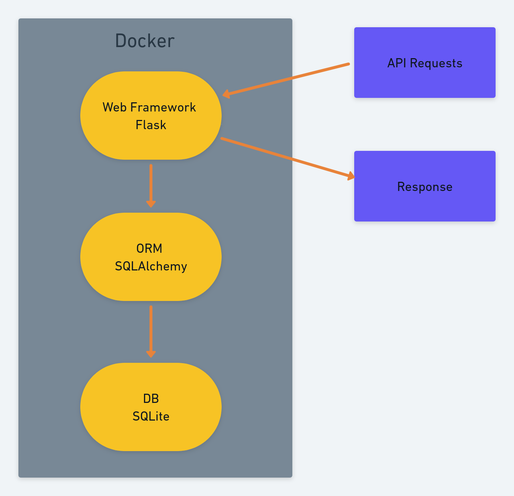

<h1 align="center">Cola Booking System</h1>

## Description

Two companies, COKE and PEPSI, are sharing an office building but as they are competitors, they don’t trust each other. Tomorrow is COLA day (for one day), that the two companies are celebrating. They are gathering a number of business partners in the building. In order to optimize space utilization, they have decided to set-up a joint booking system where any user can book one of the 20 meeting rooms available, 10 from each company (C01, C02, …, C10 and P01, P02, …., P10).

The booking system has the following functionalities:

- Users can see meeting rooms availability 
- Users can book meeting rooms by the hour (first come first served)
- Users can cancel their own reservations

### Technical documentation

For lunch application docker and docker compose should be installed.
Project has default database and data but if you want you can delete current one database and create new 

If you want just run app without creating db just run frm cola folder via docker
docker-compose up -d --build

In other case to init default db :

1. build application from terminal:
   - docker-compose up -d --build

2. copy container id:
   - docker ps

3. run command to get access to bash
   - docker exec -it {cola_app_container_id} bash

4. in bash run python command
   - python

5. from python console run default migration to create db and init default data
   - from db.migration import init_db
   - init_db()

Application can be tested via Postman

URL:
- http://localhost:5000/api/auth - for auth (Base auth) via psw and username (POST) - token will be in response
  - test user 1:
    - username: pepsiUser
    - password: pepsiPsw
  - test user 2:
    - username: cacaUser
    - password: cocaPsw
  

**Important: You should add Token to x-access-token Header to get access to other endpoint**

- http://localhost:5000/api/shifts/all - get all shifts (GET)

- http://localhost:5000/api/shifts/add     - add new shift(POST)
  - body data example:
    {
        "room_id" : 1, int
        "hours_from" : "16",
        "minutes_from" : "15",
        "hours_to" : "17",
        "minutes_to" : "15"
    }

- http://localhost:5000/api/shifts/delete/{shift_id) - delete shift by id (DELETE) 
  - example: http://localhost:5000/api/shifts/delete/3

### Technology Stack
  - Python 
  - Flask 
  - SQLAlchemy
  - SQLite
  - Docker
